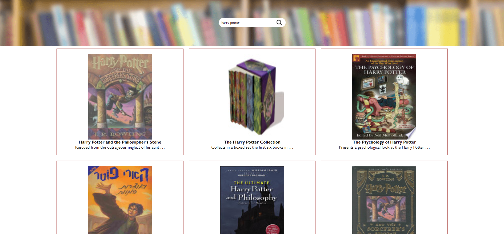

<!-- PROJECT LOGO -->
<br />
<p align="center">
    <a href="https://github.com/roee030/Book-Search-App">	
     
  </a>
  


  <h3 align="center">Search Books App</h3>

1.	To install run: ```npm install``` and to start the project run: ```npm start```.
2.  This web app will allow you to search for any book and get little info about it.
3.  Demo: https://bookssearchapp.netlify.app
</p>

